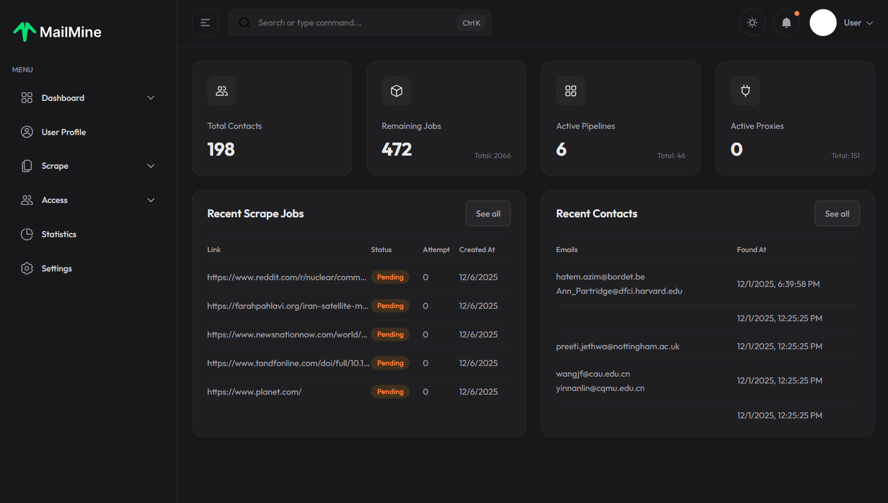
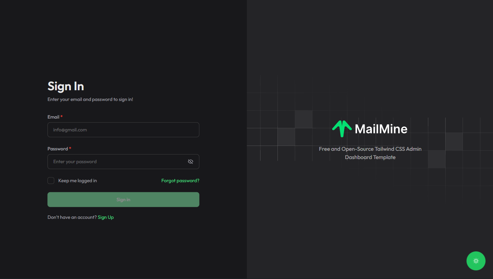

<div align="center">
  <a href="https://github.com/github_username/repo_name">
    
  </a>

  <h3 align="center">MailMine</h3>

  <p align="center">
    The Ultimate Web Scraping & Lead Generation Platform
    <br />
    <a href="#getting-started"><strong>Explore the docs »</strong></a>
    <br />
    <br />
    <a href="#demo">View Demo</a>
    ·
    <a href="#issues">Report Bug</a>
    ·
    <a href="#issues">Request Feature</a>
  </p>
</div>

<!-- BADGES -->
<div align="center">
  
  
  
  
  
</div>
<br />

<!-- TABLE OF CONTENTS -->
<details>
  <summary>Table of Contents</summary>
  <ol>
    <li>
      <a href="#about-the-project">About The Project</a>
      <ul>
        <li><a href="#built-with">Built With</a></li>
      </ul>
    </li>
    <li>
      <a href="#getting-started">Getting Started</a>
      <ul>
        <li><a href="#prerequisites">Prerequisites</a></li>
        <li><a href="#installation">Installation</a></li>
      </ul>
    </li>
    <li><a href="#usage">Usage</a></li>
    <li><a href="#roadmap">Roadmap</a></li>
    <li><a href="#contributing">Contributing</a></li>
    <li><a href="#license">License</a></li>
    <li><a href="#contact">Contact</a></li>
  </ol>
</details>

<!-- ABOUT THE PROJECT -->
## 🚀 About The Project



**MailMine** is a sophisticated web scraping and lead generation solution designed to streamline the process of gathering business intelligence. Whether you are a marketer looking for leads, a recruiter finding candidates, or a data analyst gathering insights, MailMine provides the tools to automate the extraction of emails, links, and contact information from the web.

### Key Features

*   **🕷️ Advanced Web Scraping**: Powered by Jsoup and Selenium to handle complex websites.
*   **🎯 Smart Query Generation**: Automatically generate search queries tailored to specific industries and roles.
*   **📊 Interactive Dashboard**: Visualize your scraping jobs, success rates, and data collection in real-time.
*   **🔐 Secure Authentication**: Enterprise-grade security with JWT tokens and role-based access control.
*   **⚡ High Performance**: Asynchronous processing for handling multiple scraping jobs simultaneously.
*   **📱 Responsive Design**: Fully responsive admin panel built with the latest Tailwind CSS.

<p align="right">(<a href="#readme-top">back to top</a>)</p>

### Built With

This project is built using a modern, robust tech stack ensuring scalability and performance.

*   [![Spring Boot][Spring-Boot]][Spring-url]
*   [![Next][Next.js]][Next-url]
*   [![React][React.js]][React-url]
*   [![TypeScript][TypeScript]][TypeScript-url]
*   [![TailwindCSS][TailwindCSS]][Tailwind-url]
*   [![Java][Java]][Java-url]

<p align="right">(<a href="#readme-top">back to top</a>)</p>

<!-- GETTING STARTED -->
## 🏁 Getting Started

To get a local copy up and running, follow these simple steps.

### Prerequisites

Ensure you have the following installed on your system:

*   **Java JDK 17+**
*   **Node.js 18+**
*   **Maven** (Optional, wrapper provided)

### Installation

1.  **Clone the repo**
    ```sh
    git clone https://github.com/HKH-soft/Netpick.MailMine.git
    ```

2.  **Backend Setup**
    ```sh
    cd Backend
    # Configure database in src/main/resources/application.yml
    ./mvnw spring-boot:run
    ```

3.  **Frontend Setup**
    ```sh
    cd Frontend
    npm install
    npm run dev
    ```

4.  **Access the App**
    Open your browser and navigate to `http://localhost:3000`.

<p align="right">(<a href="#readme-top">back to top</a>)</p>

<!-- USAGE EXAMPLES -->
## 💻 Usage

### Secure Sign In
Access your dashboard securely. The system supports persistent login sessions.



### Managing Scrape Pipelines
1.  Navigate to the **Scrape** section.
2.  Then in **Control** select what part of the scraping you want to start
3.  Monitor the progress in real-time on the dashboard.

<p align="right">(<a href="#readme-top">back to top</a>)</p>

<!-- ROADMAP -->
## 🗺️ Roadmap

- [x] Basic Web Scraping
- [x] User Authentication
- [x] Proxy Support
- [ ] Grafana Dashboard Analytics
- [ ] API Access for 3rd Party Apps
- [ ] Cloud Deployment Scripts (Docker)

See the [open issues](https://github.com/github_username/repo_name/issues) for a full list of proposed features (and known issues).

<p align="right">(<a href="#readme-top">back to top</a>)</p>

<!-- CONTRIBUTING -->
## 🤝 Contributing

Contributions are what make the open source community such an amazing place to learn, inspire, and create. Any contributions you make are **greatly appreciated**.

1.  Fork the Project
2.  Create your Feature Branch (`git checkout -b feature/AmazingFeature`)
3.  Commit your Changes (`git commit -m 'Add some AmazingFeature'`)
4.  Push to the Branch (`git push origin feature/AmazingFeature`)
5.  Open a Pull Request

<p align="right">(<a href="#readme-top">back to top</a>)</p>

<!-- LICENSE -->
## 📝 License

Distributed under the MIT License. See `LICENSE` for more information.

<p align="right">(<a href="#readme-top">back to top</a>)</p>

<!-- CONTACT -->
## 📧 Contact

Hossein - hkh.soft.eng@gmail.com

Project Link: [https://github.com/HKH-soft/Netpick.MailMine](https://github.com/HKH-soft/Netpick.MailMine)

<p align="right">(<a href="#readme-top">back to top</a>)</p>

<!-- MARKDOWN LINKS & IMAGES -->
[Spring-Boot]: https://img.shields.io/badge/Spring_Boot-F2F4F9?style=for-the-badge&logo=spring-boot
[Spring-url]: https://spring.io/projects/spring-boot
[Next.js]: https://img.shields.io/badge/next.js-000000?style=for-the-badge&logo=nextdotjs&logoColor=white
[Next-url]: https://nextjs.org/
[React.js]: https://img.shields.io/badge/React-20232A?style=for-the-badge&logo=react&logoColor=61DAFB
[React-url]: https://reactjs.org/
[TailwindCSS]: https://img.shields.io/badge/Tailwind_CSS-38B2AC?style=for-the-badge&logo=tailwind-css&logoColor=white
[Tailwind-url]: https://tailwindcss.com/
[TypeScript]: https://img.shields.io/badge/TypeScript-007ACC?style=for-the-badge&logo=typescript&logoColor=white
[TypeScript-url]: https://www.typescriptlang.org/
[Java]: https://img.shields.io/badge/Java-ED8B00?style=for-the-badge&logo=openjdk&logoColor=white
[Java-url]: https://www.java.com/
